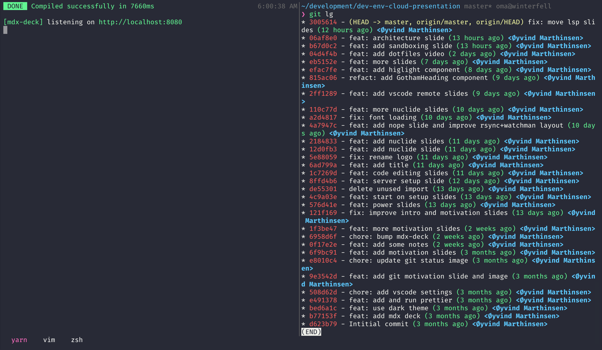
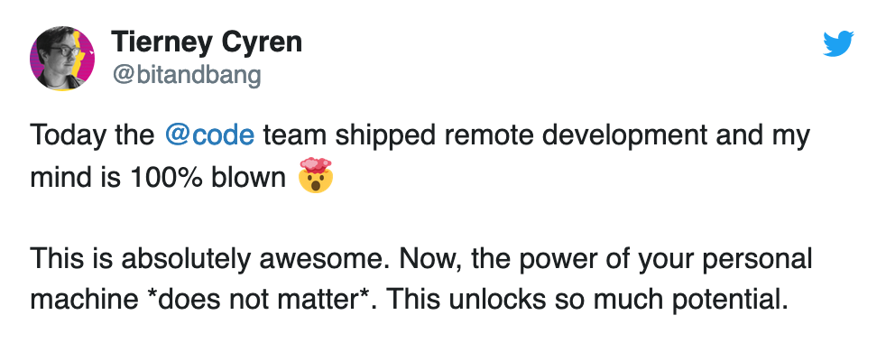
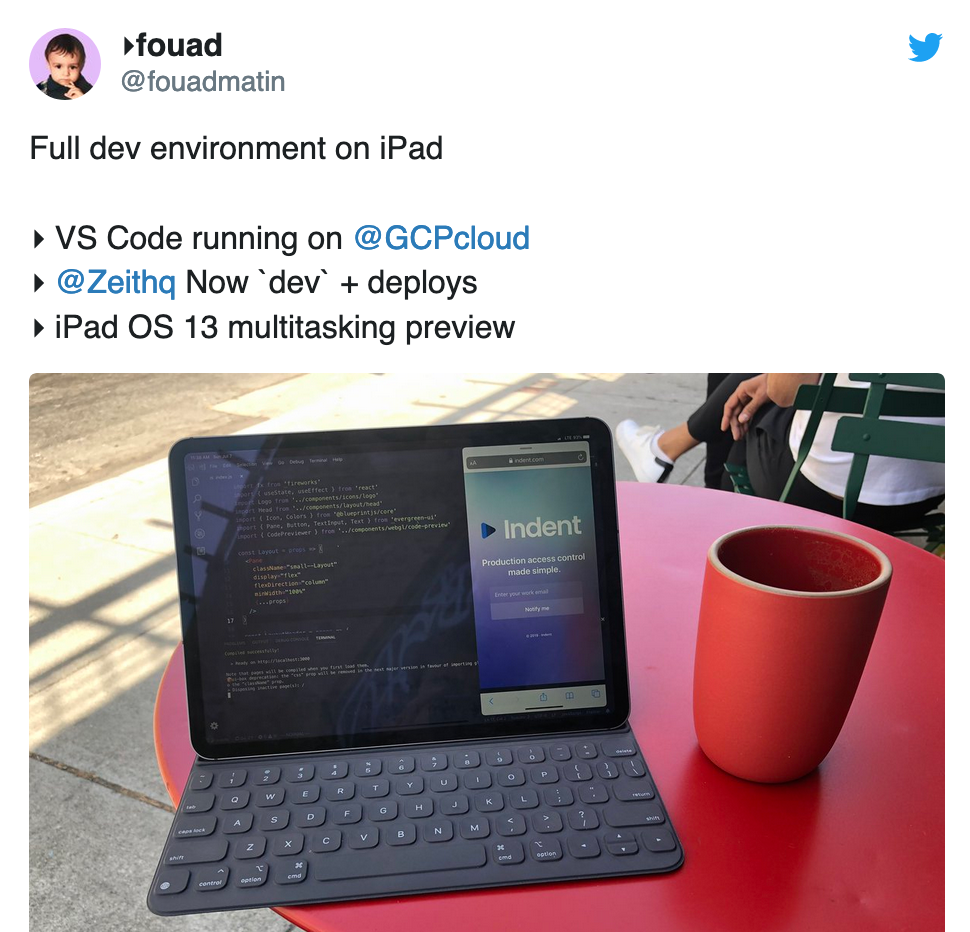
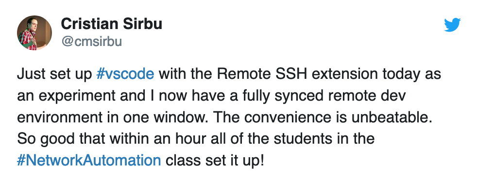

import { Appear } from '@mdx-deck/components';
import { Notes, Head, Image } from 'mdx-deck';
import { Invert, Split, Horizontal } from '@mdx-deck/layouts';

import { Flip } from './Flip';
import { AlignLeft } from './AlignLeft';
import { Highlight } from './Highlight';
import { GothamHeading } from './GothamHeading';
import './public/fonts.css';

export { default as theme } from './theme';

<Head>
  <title>Developing in the cloud</title>
</Head>

<!--- Intro -->

## Development Environment in the Cloud

<Notes>
Hi! Today I'm going to talk about my experience with exploring and setting up an development environment in the cloud.

- Playground project

</Notes>

---

## Agenda

- Motivation
- Setup
- Approaches and constraints
- Tips and tricks

---

# Øyvind Marthinsen

Front-end developer

@oyvinmar

<Notes>

Who am I?

- Front-end developer
- Experience with the full stack
- Passionate about tooling and workflow
- @oyvinmar on the internet

</Notes>

<!--- Motivation -->

---

# Motivation

---

# Motivation

<ul>
  <Highlight item={0}>
    <li>Continue where I left of</li>
    <li>All that power</li>
    <li>Sandboxing</li>
  </Highlight>
</ul>

<Notes>

- Biggest motivation for me
- N.B. I prefer not to tavel with a laptop

</Notes>

---

<h1><Flip>🏃</Flip> → <Flip>🚋</Flip> → 🧸👶🏻 → 👨🏻‍🍳 → 🛌 → 👨🏻‍💻</h1>

<Notes> After work timeline </Notes>

---


<Notes>

- Status at the end of workday

</Notes>

---

##

# :office:

```bash
git commit -am "wip"
git push
```

<Notes>

Just use Git. Problem solved.

</Notes>

---

# :house_with_garden:

```bash
git pull
git checkout --track accordion-improvements
yarn start
```

<Notes>

Easy right?

</Notes>

---

## Is repo up to date?

- Are dependencies up to date?
- Any new environment variables?
- Does the feature depend on any other services?

---

## Is environment up to date?

- Build tools (yarn, npm, maven)
- Runtime (node, java, python, docker)
- Development tools (git, terminal, browser)

---

## I'm always tinkering

- Changing shell exports/aliases
- Installing new command line tools
- Changing config

---

# Motivation

<ul>
  <Highlight item={1}>
    <li>Continue where I left of</li>
    <li>All that power</li>
    <li>Sandboxing</li>
  </Highlight>
</ul>

---

# MacBook 12"

## 1,3 GHz Intel Core m7

<Notes>

- Computer at home
- Works for web development
- Not suited for heavy tasks (i.e. multiple docker containers)

</Notes>

---

## On demand scalability

<video src="public/scalability.mp4" autoPlay loop />

<Notes>

- Not locked to a physical device
- Scale CPU/RAM after task

</Notes>

---

# Motivation

<ul>
  <Highlight item={2}>
    <li>Continue where I left of</li>
    <li>All that power</li>
    <li>Sandboxing</li>
  </Highlight>
</ul>

---

### Sandbox the development environment


<Notes>

- Testing new languages/development tools
- Separate server for each project
- Easy project switching (i.e. running docker container)

</Notes>

---

<!--- Setup -->

# Setup

---

<h2 style={{marginBottom: '-0.5em'}}>Architecture</h2>


<Notes>

- The server runs a web server
- The server supports web sockets
- The browser can easily be replaced by a REST-client
- The client/editor edits files securely through ssh
- An alternative to a web server is SSH port forwarding.

</Notes>

---


- Cheap and predictable pricing
- Simple interface
- Already had an account

---

## Server setup

- Ubuntu
- Development tools (git, Node.js, etc)
- SSH login
- NGINX
- Let's Encrypt

<Notes>

- Ubuntu with firewall enabled.
- Web sockets enabled in NGINX
- Standard web server setup.
- An alternative to NGINX is SSH port forwarding.

</Notes>

---

## Editing code

<video src="public/coding.mp4" autoPlay loop />

<Notes>

Server setup was pretty straightforward, but how to edit the code from remote was the hard part.

</Notes>

---

## Approaches

- SSH
- rsync + watchman
- Nuclide
- VSCode remote-development extension

---

## Keep it simple, stupid (KISS)

Use ssh and run vim or emacs on the server

---

<video src="/public/nope.mp4" autoPlay loop />

<Notes>

- I prefer VSCode

</Notes>

---

## rsync + watchman

<Split>


<GothamHeading
  style={{
    marginTop: 0,
    marginLeft: '1.5em',
  }}
>
  Watchman
</GothamHeading>

</Split>

<Notes>

- Use watchman to watch for local file changes and use rsync to send them to the server

</Notes>

---

## All tooling must run locally

<Appear>
  <video src="public/throw_paper.mp4" autoPlay loop />
</Appear>

<Notes>

- For example linting, type checking, compiling etc
- Issues with git

</Notes>

---

## Language Server Protocol (LSP)

<AlignLeft>

Builtin: VSCode, Atom, Eclipse Che

Plugins: Sublime, vim/neovim, Emacs, etc..

</AlignLeft>

<Notes>

- Warning: Minor digression. But this is what enables the next two approaches I will describe
- Standardized protocol for how an editor and a language server communicate. The server provides advanced language information.

</Notes>

---


<Notes>

- Example of how communication flows.
- Server enables features such as autocomplete, goto definition, or documentation on hover.

</Notes>

---

<GothamHeading
  variant="h1"
  style={{
    display: 'flex',
    alignItems: 'center',
  }}
>
  
  <span style={{ marginLeft: '12px' }}>Nuclide</span>
</GothamHeading>

- The Facebook "IDE"
- Atom with a bunch of plugins
- Built in remote development support

<Notes>

- Next approach

</Notes>

---

## Digging into Nuclide source

<video src="public/digging.mp4" autoPlay loop />

<Notes>

How is this stuff implemented?

</Notes>

---

## Nuclide VSCode extension

> Adds remote development capabilities to vscode 🤠

<Notes>

- Communicates with a fork of the nuclide server

</Notes>

---

## Nuclide VSCode extension

- Secure bidirectional channel
- File operations
- CVS integration (Mercurial)
- LSP integration

<Notes>

- Automatically install a server on the host
- Written in javascript with flow types

</Notes>

---

## I can hack this

<video src="public/hacking.mp4" autoPlay loop />

---

## Nuclide VS Code extension

- Secure bidirectional channel ✅
- File operations ✅
- CVS integration ⏸
- LSP integration 🏗

---


---

## VSCode Remote - SSH

> Open a remote folder on any remote machine, virtual machine, or container with a running SSH server.

---

## Can use all VSCode features

- UI Extensions run locally 🏡
- Workspace extensions remotely 🏢
- Debugging on the SSH host 🐛
- Forward port from host 🚀

<Notes>

- UI (snippets, keymaps vim/emacs, themes)
- Workspace (completion, linters, formatter)
- Debug
- SSH port forwarding

</Notes>

---

# TL;DR

## It just works

---

## Minor issues

- SSH connection hangs sometimes
- Slower assets download
- Not open source
- Does not solve config

<Notes>

- When waking from sleep. Not explored in depth.
- Big js bundles with embedded source maps can be an issue (10 mb). Hot-module reloading mitigates the issue
- Microsoft Azure bundling?
- Actually exacerbate the need for automating config

</Notes>

---

# Tips and tricks

---

## Master the command line

- Learn SSH and SCP
- Master a terminal editor (vim, emacs, nano)
- File operations (ls, mv, rm)
- Process management (ps, top, kill)

---

## Keep config in dotfiles

<video
  src="public/dotfiles.mp4"
  autoPlay
  loop
  style={{ maxWidth: '70%' }}
/>

<Notes>

- Link config/dotfiles (shell, vim, ssh, tmux).
- Install the tools I most commonly use.
- Can re-execute the command at any time to synchronize anything that might have changed.

</Notes>

---

## Use tmux



<Notes>

- Why haven't I used this before??
- Terminal multiplexer (what the hell does that mean?)
- Basically a window manger inside your terminal
- Sessions is the thing that makes it invaluable for remote development
- Can exit/detach from a session (i.e. disconnect from the server) and tmux keeps the session alive

</Notes>

---

## Unexplored benefits

- Develop in the production/test environment
- Great for onboarding?
- Security
- Develop on an tablet (i.e. iPad)

<Notes>

- Test code in the real environment. Low latency other service. Easier project setup?
- Automating project development setup
- No sensitive info on computer
- See CodeServer. Develop with VSCode in the browser

</Notes>

---

### Hype

<Split>

<div>





</div>




</Split>

<Notes>

- Not mainstream, but getting there.
- Looking for buzz (and seeing it)
- Facebook and Google have done this for years

</Notes>

---

<AlignLeft>

# Links

[Digital Ocean](https://www.digitalocean.com/)
[rsync](https://en.wikipedia.org/wiki/Rsync)
[Watchman](https://facebook.github.io/watchman/)
[SSH](https://en.wikipedia.org/wiki/Secure_Shell)
[Let’s Encrypt](https://letsencrypt.org/)
[Language Server Protocol](https://langserver.org/)
[VSCode Remote SSH Extension](https://marketplace.visualstudio.com/items?itemName=ms-vscode-remote.remote-ssh)
[VSCode Remote Development using SSH (tutorial)](https://code.visualstudio.com/docs/remote/ssh)
[Nuclide](https://nuclide.io/)
[Dotfiles guide](http://dotfiles.github.io/)
[My dotfiles](https://github.com/oyvinmar/dotfiles)

 </AlignLeft>

---

## Thanks for listening!
[https://dev-env-in-the-cloud.now.sh/](https://dev-env-in-the-cloud.now.sh/)
