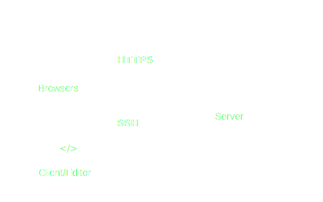

import { Appear } from '@mdx-deck/components';
import { Notes, Head, Image } from 'mdx-deck';
import { Invert, Split, Horizontal } from '@mdx-deck/layouts';

import { Flip } from './Flip';
import { Highlight } from './Highlight';
import { GothamHeading } from './GothamHeading';

export { default as theme } from './theme';

<Head>
  <title>Developing in the cloud</title>
</Head>

<!--- Intro -->

## Development Environment in the Cloud

<Notes>
Hi! Today I'm going to talk about my experience with exploring and setting up an development environment in the cloud.
- Playground project

</Notes>

---

# Agenda

- Motivation
- Setup
- Approaches and constraints
- Tips and tricks

---

# Øyvind Marthinsen

Front-end developer

@oyvinmar

<Notes>

Who am I?

- Front-end developer
- Experience with the full stack
- Passionate about tooling and workflow
- @oyvinmar on the internet

</Notes>

<!--- Motivation -->

---

# Motivation

---

# Motivation

<ul>
  <Highlight item={0}>
    <li>Continue where I left of</li>
    <li>All that power</li>
    <li>Sandboxing</li>
  </Highlight>
</ul>

---

<h1><Flip>🏃</Flip> → <Flip>🚋</Flip> → 🧸👶🏻 → 👨🏻‍🍳 → 🛌 → 👨🏻‍💻</h1>

<Notes> After work timeline </Notes>

---


<Notes>

- Status at the end of workday
- N.B. I prefer not to tavel with a laptop

</Notes>

---

##

# :office:

```bash
git commit -am "wip"
git push
```

<Notes>

Just use Git. Problem solved.

</Notes>

---

# :house_with_garden:

```bash
git pull
git checkout --track accordion-improvements
yarn start
```

<Notes>

Easy right?

</Notes>

---

## Is repo up to date?

- Are dependencies up to date?
- Any new environment variables?
- Does the feature depend on any other services?

---

## Is development env up to date?

- Build tools (yarn, npm, maven)
- Runtime (node, java, python, docker)
- Development tools (git, terminal, editor, browser)

---

## I'm always tinkering

- Changing shell exports/aliases
- Installing new command line tools
- Changing config

---

# Motivation

<ul>
  <Highlight item={1}>
    <li>Continue where I left of</li>
    <li>All that power</li>
    <li>Sandboxing</li>
  </Highlight>
</ul>

---

# MacBook 12"

## 1,3 GHz Intel Core m7

<Notes>

- Computer at home
- Works for web development
- Not suited for heavy tasks (i.e. multiple docker containers)

</Notes>

---

## On demand scalability

<video src="public/scalability.mp4" autoPlay loop />

---

# Motivation

<ul>
  <Highlight item={2}>
    <li>Continue where I left of</li>
    <li>All that power</li>
    <li>Sandboxing</li>
  </Highlight>
</ul>

---

### Sandbox the development environment


<Notes>

- Testing new languages/development tools
- Easy project switching (i.e. running docker container)

</Notes>

---

# Other

- Facebook/Google/Microsoft have internal solutions
- Great for onboarding?
- Security
- Develop on an tablet (i.e. iPad)

<Notes>

- Facebook/Google/Microsoft have internal solutions.
- Automating project development setup
- Good bye MacBook

</Notes>

---

<!--- Setup -->

# Setup

---

## Architecture



---


<Appear>

- Cheap and predictable pricing
- Simple interface
- Already had an account

</Appear>

---

## Server setup

- Ubuntu
- Development tools (git, Node.js, etc)
- SSH login
- NGINX
- Let's Encrypt

<Notes>

- Pretty strait forward.
- Ubuntu with firewall enabled.
- An alternative to NGINX is SSH port forwarding.

</Notes>

---

# Editing code

<video src="public/coding.mp4" autoPlay loop />

---

## Approaches

- SSH
- rsync + watchman
- Nuclide
- VSCode remote-development extension

---

## Keep it simple, stupid (KISS)

Use ssh and run vim or emacs on the server

---

<video src="/public/nope.mp4" autoPlay loop />

<Notes>

- I prefer VSCode

</Notes>

---

## rsync + watchman

<Split>


<GothamHeading
  style={{
    marginTop: 0,
  }}
>
  Watchman
</GothamHeading>

</Split>

<Notes>

- Use watchman to watch for local file changes and use rsync to send them to the server

</Notes>

---

## All tooling must run locally

<Appear>
  <video src="public/throw_paper.mp4" autoPlay loop />
</Appear>

<Notes>

- For example linting, type checking, compiling etc
- Issues with git

</Notes>

---

<GothamHeading
  variant="h1"
  style={{
    display: 'flex',
    alignItems: 'center',
  }}
>
  
  <span style={{ marginLeft: '12px' }}>Nuclide</span>
</GothamHeading>

- The Facebook "IDE"
- Atom with a bunch of plugins
- Built in remote development support

---

# Language Server Protocol (LSP)

<Notes>

- Standardized protocol for how an editor and a language server communicate. The server provides advanced language information.

</Notes>

---

<Invert>


</Invert>

<Notes>

- Example of how communication flows.
- Server enables features such as autocomplete, goto definition, or documentation on hover.

</Notes>

---

## Digging into Nuclide source

<video src="public/digging.mp4" autoPlay loop />

<Notes>

How complex is this stuff?

</Notes>

---

## Nuclide VSCode extension

Adds remote development capabilities to vscode

<Notes>

- Communicates with a fork of the nuclide server

</Notes>

---

## Nuclide VSCode extension

- Secure bidirectional channel
- File operations
- CVS integration (Mercurial)
- LSP integration

<Notes>

- Written in javascript

</Notes>

---

## I can hack this

<video src="public/hacking.mp4" autoPlay loop />

---

## Nuclide VSCode extension

- Secure bidirectional channel ✅
- File operations ✅
- CVS integration ⏸
- LSP integration 🏗

---


---

## Visual Studio Code Remote - SSH

> Open a remote folder on any remote machine, virtual machine, or container with a running SSH server.

---

# Can use all VSCode features

- UI Extensions run locally (snippets, keymaps, etc)
- Workspace extensions remotely (completions, linter, formatter)
- Debugging on the SSH host
- Forward port from host

---

# TL;DR

## It just works

---

# Minor issues

- SSH connection hangs sometimes (waking up from sleep)
- Slower assets download
- Does not solve config

---

# Dotfiles

<video
  src="public/dotfiles_init.mp4"
  autoPlay
  loop
  style={{ maxWidth: '70%' }}
/>

---

# Tips and tricks

- Become familiar with the command line
- Use tmux
- Learn SCP/SSH

---

# Hype

<Split>


</Split>

---

# Links

---
