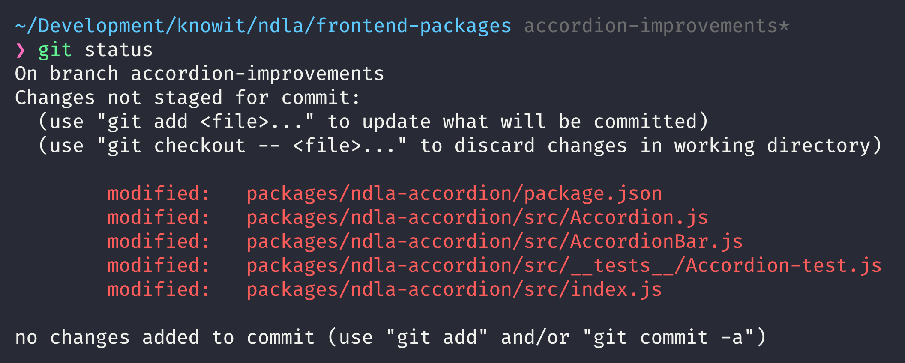

import { Image } from '@mdx-deck/components';
import { Notes } from 'mdx-deck';

export { dark as theme } from '@mdx-deck/themes';

# Development Environment in the Cloud

---

# About Me

---

# Motivation

---

---

## git ci -am "wip"

---

- git pull
- git checkout accordion-improvements
- yarn
- yarn start

---

## Is devenv up to date?

- Buildtools (yarn, npm, maven)
- Runtime (node, java, python)
- Devtools (git, terminal, editor, browser)

---

## I'm always tinkering

- Changing shell exports/aliases
- Installing new commandline tools
- Changing config

---

## Continue where I left of

---

## 1,3 GHz Intel Core m7

:heart: that machine

<Notes>
  <ul>
    <li>
      Works for webdev, but not for heavy tasks (i.e. multiple docker
      containers)
    </li>

  </ul>
</Notes>
